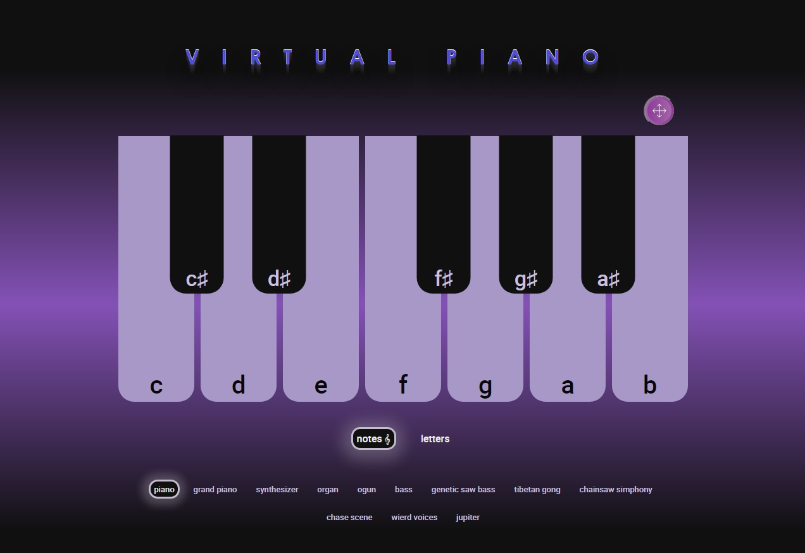
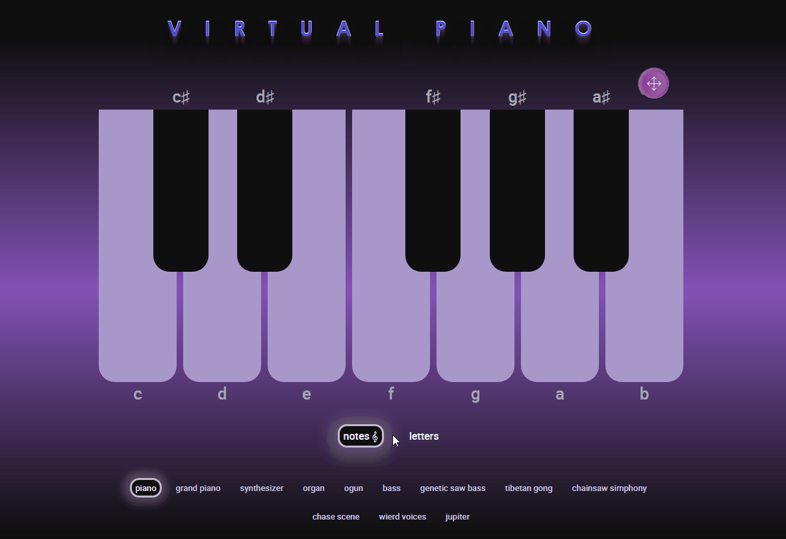

<!-- # Task name: [virtual-piano](https://rolling-scopes-school.github.io/stage0/#/stage1/tasks/virtual-piano-hints) -->
<!--  -->

## [virtual piano](https://dzmitry-duboyski-virtual-piano.netlify.app)

The [virtual piano](https://dzmitry-duboyski-virtual-piano.netlify.app) app, is an emulation of a piano, with the ability to change musical instruments. The application allows you to play the virtual piano using both the mouse and the keyboard.

# Application features:
- Play sounds on mouse or keyboard clicks.
- Ability to play sounds from different keys of the piano using the held down mouse button (the effect when you move your finger across the piano).
- Change the used musical instrument.
- Displays the currently pressed piano key.
- Change display mode: 'letters' - shows the used keyboard keys near the piano keys, 'notes' - shows the played notes near the piano keys.
- Implemented a full screen mode of the application.

# Let's play 😉:
1. Open page: [virtual piano](https://dzmitry-duboyski-virtual-piano.netlify.app)
2. There are two ways to extract sounds from the piano:

   - Mouse - use your mouse to click on the piano keys.
   

   - Use your keyboard to hit the piano keys. For pressing, use the following keyboard buttons 'd' 'r' 'f' 't' 'g' 'h' 'u' 'j' 'i' 'k' 'o' 'l'.
3. To change a musical instrument, select your favorite instrument at the bottom of the screen, and click on its name.